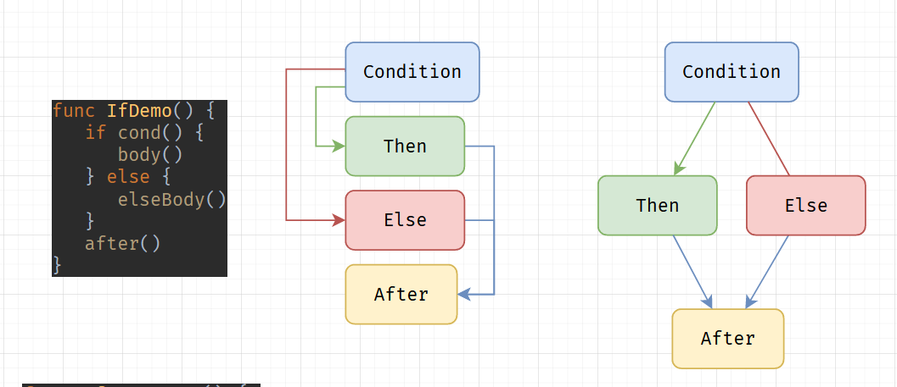
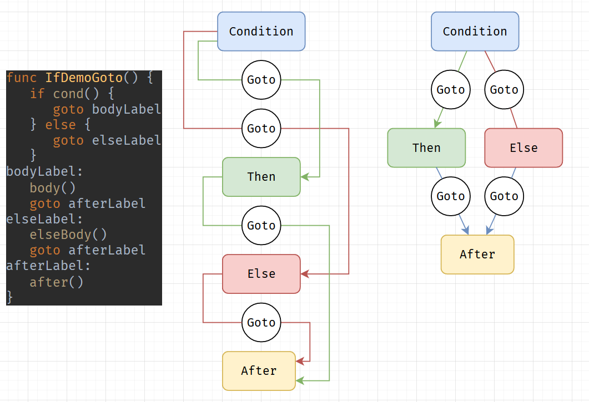

<!--
Here I just want to introduce myself and the topic.
Just a slide to put in the start and skip as soon as I start 
talking.
 -->

# Generating Generators
### Rolling Your Own Python-Style Generators

- Tamir Bahar
- (He/Him)
- @tmr232 (Github, Twitter)

---

<!-- 
I am a long time Pythonista, but a relatively new Gopher.
When I learning Go, I really enjoyed the simple design.
It was easy to get started, and easy to become productive.

Most importantly - the experience when reading the standard 
library or random OSS projects was that I can understand them.
The code tends to be straightforward and similarly styled.

But as I kept coding, there was one thing that I really missed.
Generators.
 -->

# From Python To Go

- Simple & Straightforward
- Easy to dive into new code

---

<!-- 
Before I start talking about Generators,
I want to show you my regular workflow when working with new APIs.
This is the same both for local APIs and data structures, 
and for REST and other remote APIs.

I usually start by playing with the API.
If it queries data - I try to print that data so that
I know what I am actually getting from it and that I 
am calling it correctly.
 -->

# My Workflow

1. Query & Print
2. Wrap & Use

---

<!-- 
So with this example - I want to get all the "things"
from the api.

I use `fmt.Println` to display things, and use `panic`
as a form of error handling.
 -->

 # My Workflow

```go
func PrintThings(client *ApiClient) {
	var result Result
	var err error
	for {
		result, err = client.GetThings(result.Next)
		if err != nil {
			panic(err)
		}
		for _, thing := range result.Things {
			fmt.Println(thing)
		}
		if result.Next == nil {
			break
		}
	}
}
```

---

# Iterators

<!-- 
The next step, once we see that this is actually working,
is to write the actual business logic.

For that, I would much rather avoid duplicating the API-handling
code.
I prefer to handles queries, filters, pagination, etc. in one place,
and do the business logic in another.

This leaves me with 2 options.
One - complete the entire query, and return a slice with the results.
This is simple, but may get _very_ time consuming with some APIs.
Additionally, I prefer to avoid unnecessary network communication.
Two - convert my simple loop into an iterator.
If I do that, I can loop over the results _as if_ I had a slice,
but only access the ones I really need.
 -->

```go
items, err := GetAllItems(client)
if err != nil {
	panic(err)
}
for _, item := range items {
	fmt.Println(item)
}
```

```go
itemIterator := IterItems(client)
for itemIterator.Next() {
	item := itemIterator.Value()
	fmt.Println(item)
}
if itemIterator.Err() != nil {
	panic(err)
}
```

---

# Implementing Iterators

<!-- 
So we go to implement the iterator.
This usually has multiple parts that we need to write
 -->

 ```go
 type ThingIterator struct {...}
 func NewThingIterator(...) *ThingIterator
 func (it *ThingIterator) Next() bool
 func (it *ThingIterator) Value() Thing
 func (it *ThingIterator) Err() error
 ```

 <!-- 
 The struct holds the state for our iteraton.
 We have a constructor to initialize it, 
 as the zero value might not be useful in some cases.
 `Value()` and `Err()` can be implemented as trivial getters.
 `Next()`, however, is where the tricky part lies!
  -->


---

# Single Function Iterators

<!-- 
While an iterator is comprised of many separate parts,
only the `Next()` function does any actual work.
So I like using the following helper when I write them:
 -->

 ```go
 type SingleFunctionIterator[T any] struct {
	Advance func() (hasValue bool, value T, err error)
	value   T
	err     error
}

func (it *SingleFunctionIterator[T]) Next() bool {
	hasValue, value, err := it.Advance()
	it.value = value
	it.err = err
	return hasValue
}

func (it *SingleFunctionIterator[T]) Value() T {
	return it.value
}

func (it *SingleFunctionIterator[T]) Err() error {
	return it.err
}
 ```

 

---
  # Next()

<!-- 
First - if we don't have any result yet, we get it.
If we encounter an error, we report it and finish.
Then, we check if the current index fits in the current result - if it does, set `value`.
If we consumed the current result, we check if there's another one.
If there isn't, we terminate.
Once we get the new result, we call `Next()` again to get the actual value.
-->

```go
func (it *ThingIterator) Next() bool {
	if it.result == nil {
		result, err := it.client.GetThings(nil)
		if err != nil {
			it.err = err
			return false
		}
		it.result = &result
	}
	
    if it.index < len(it.result.Things) {
        it.value = it.result.Things[it.index]
        it.index++
        return true
    }
    it.index = 0

    if it.result.Next == nil {
        return false
    }

    result, err := it.client.GetThings(it.result.Next)
    if err != nil {
        it.err = err
        return false
    }
    it.result = &result
	
	return it.Next()
}

```

---

# The Problem - Complexity

<!--
And this is where our second, and more pressing issue is.
Now, you may be far better programmers than I am.
Or more experienced with this style of iteration.
But while the original printing loop took me a single attempt to get right, 
this one took me multiple tries, and significantly more time.
When I was sure it works, I tested it, and it still didn't.

To me, that's not readable, intuitive, or maintainable.
It's a difficult pattern to work with.
Not just because the lack of familiarity, but because it causes a split in the control flow.
We have a function that does a _single_ iteration, and the actual loop is only present in the call-site.
As a reader, I never really see the whole picture. 
And, unlike loops - there are many different ways to implement this code. 
Many styles, and different considerations.
And if the API changes, you need to work out the kinks in this complex piece of code.
 -->

- Iterators are complicated
- The logic is broken up
- Not obvious to read or implement
- Hard to maintain
**Slide should show comparison of simple iteration with `PrintLn`
compared against the entire iterator implementation**

---

# The Solution - Generators

```go
func IterThings(client *ApiClient) gengen.Generator[Thing] {
	var result Result
	var err error
	for {
		result, err = client.GetThings(result.Next)
		if err != nil {
			return err
		}
		for _, thing := range result.Things {
			gengen.Yield(thing)
		}
		if result.Next == nil {
			break
		}
	}
	return nil
}
```

Compare it with the print function:

```go
func PrintThings(client *ApiClient) {
	var result Result
	var err error
	for {
		result, err = client.GetThings(result.Next)
		if err != nil {
			panic(err)
		}
		for _, thing := range result.Things {
			fmt.Println(thing)
		}
		if result.Next == nil {
			break
		}
	}
}
```

<!-- 

Several things changed - 
1. We now return a `Generator` of `Thing`
2. We return the errors instead of panicking
3. And most importantly, we use `gengen.Yield(thing)`
    instead of printing it.

Functionally, our new `IterThings()` function is completely
equivalent to the constructor of our manually written iterator.
The only significant difference is that it's easier to write.
Additionally, it introduces some new syntax and semantics to the code
to make this magic work.

In the rest of the talk, we'll see how they really work.
 -->

---

 # What is a Generator?

 <!-- 
 This slide should have a visalization of the execution:
 Showing highlighted lines here, and the iteration loop
 with `Value()`, `Err()`, and `Next()`, and the return values.
  -->

```go
func SimpleGenerator() gengen.Generator[int] {
    gengen.Yield(1)
    gengen.Yield(2)
    gengen.Yield(3)
    return nil
}
```
- A "generator function" is any function calling `gengen.Yield()`
- When we call a generator function, we get a generator back.
- But the code in the function doesn't run yet!
- The code in the generator function is run when calling `Next()`
    on the generator
- Then, it runs until `Yield()` yields a value (using `Value()`)
- The next time we call `Next()`, it will start right after that `Yield()`
- When we reach `return`, the generator will finish executing.
- If we want to report an error, we'll use the `return` statement as well.


---

# Implementing Generators

<!-- 
Our generators are going to be implemented by transforming the
code we just saw, into regular Go code.
Luckily for us, Go has amazing tools for static analysis and 
code generation.
We'll cover the code transformations, and avoid the actual
implementation as it is not too interesting.

We'll start with a straightforward generator, and slowly work
our way to more complex patterns.

The idea here is to show the gradual transformation of the code.

 -->

```go
func SimpleGenerator() gengen.Generator[int] {
    gengen.Yield(1)
    gengen.Yield(2)
    gengen.Yield(3)
    return nil
}


/*
First, we copy our generator code into a SingleFunctionIterator's
Advance() function.
*/
func SimpleIterator() SingleFunctionIterator[int] {
    return SingleFunctionIterator[int]{
        Advance: func() (hasNext bool, value int, err error) {
                gengen.Yield(1)
                gengen.Yield(2)
                gengen.Yield(3)
                return nil
        }
    }
}

/*
Then we transform the `Yield` so that it actually yields the value.
But we have an issue - we'll always yield only the first value!
*/
func SimpleIterator() SingleFunctionIterator[int] {
    return SingleFunctionIterator[int]{
        Advance: func() (hasNext bool, value int, err error) {
                hasNext = true
                value = 1
                err = nil
                return
                gengen.Yield(1)
                gengen.Yield(2)
                gengen.Yield(3)
                return nil
        }
    }
}


/*
So we add a `goto` and a condition  - if we're in the second iteration we just go for the second `Yield()`.
*/
func SimpleIterator() SingleFunctionIterator[int] {
    secondIteration := false
    return SingleFunctionIterator[int]{
        Advance: func() (hasNext bool, value int, err error) {
                if (secondIteration) {
                    goto secondIterationLabel
                }
                hasNext = true
                value = 1
                err = nil
                secondIteration = true
                return
            secondIterationLabel:
                gengen.Yield(2)
                gengen.Yield(3)
                return nil
        }
    }
}

/*
But since we're automating - we don't want to deal with names.
Instead, we'll use a single `__next` variable for all the labels,
and a `switch` to choose where to go.
*/

func SimpleIterator() SingleFunctionIterator[int] {
    return SingleFunctionIterator[int]{
        __next := 0
        Advance: func() (hasNext bool, value int, err error) {
                switch __next {
                    case 0: goto __Next0
                    case 1: goto __Next1
                    case 2: goto __Next2
                    case 3: goto __Next3
                }
            __Next0:
                __next = 1
                hasNext = true
                value = 1
                err = nil
                return
            __Next1:
                gengen.Yield(2)
            __Next2:
                gengen.Yield(3)
            __Next3:
                return nil
        }
    }
}


/*
Last but not least - we transform the `return` statement
to stop the iteration.
*/
func SimpleIterator() SingleFunctionIterator[int] {
    __next := 0
    return SingleFunctionIterator[int]{
        Advance: func() (hasNext bool, value int, err error) {
                switch __next {
                    case 0: goto __Next0
                    case 1: goto __Next1
                    case 2: goto __Next2
                    case 3: goto __Next3
                }
            __Next0:
                __next = 1
                hasNext = true
                value = 1
                err = nil
                return
            __Next1:
                gengen.Yield(2)
            __Next2:
                gengen.Yield(3)
            __Next3:
                return false, 0, nil
        }
    }
}
```

---

# Conditions

<!-- 
Now that we know how a `gengen.Yield()` call and a `return`
statement are transformed, we can start dealing with control flow.

Here we have a simple iterator with an `if` statement.


 -->

```go
func IfGenerator(alpha bool) gengen.Generator[string] {
    if alpha {
        gengen.Yield("a")
        gengen.Yield("b")
        gengen.Yield("c")
    } else {
        gengen.Yield("1")
        gengen.Yield("2")
        gengen.Yield("3")
    }
    return nil
}
```

<!-- 
We start with the same transformations,
but immediately encounter an issue.

Go's `goto` statement cannot jump into blocks.
So we can't just place a label in the `if` and jump to it.
We need a different solution.
 -->

 ```go
func IfGenerator(alpha bool) SingleFunctionIterator[int] {
    __next := 0
    return SingleFunctionIterator[int]{
        Advance: func() (hasNext bool, value int, err error) {
                switch __next {
                    case 0: goto __Next0
                    case 1: goto __Next1
                    case 2: goto __Next2
                    case 3: goto __Next3
                }
            __Next0:
                if alpha {
                    gengen.Yield("a")
                __Next1:
                    gengen.Yield("b")
                    gengen.Yield("c")
                } else {
                    gengen.Yield("1")
                    gengen.Yield("2")
                    gengen.Yield("3")
                }
                return nil
        }
    }
}
 ```
---

# Control Flow

<!-- 
`if`, as well as the other control flow structures,
control the flow of the code in a structured way.

We flow from top to bottom (except loops) and from
left to right.
Inner blocks do not directly affect the flow of parent blocks.
It's all nice and structured.

`goto` breaks that structure, so we tend to avoid it.
But in our case, it proves useful once more. 

A simple `if` condition can be represented with the following graph:


-->



---

# Control Flow

<!--
Using `goto` we can rearrange the nodes of the graph,
while maintaining the same flow
 -->



<!-- 
With this transformation - the body of the `if` is no longer
inside a block, and we can now `goto` directly to it.
 -->

 # For Loops

 <!-- 
 Go has ~4 types of for loops, and we need to cover them all.
  -->
```go
// This is an infinite loop.
for {
    gengen.Yield(1)
}

// While
for cond() {

}

// C-style
for i := 1; i < 10; i++ {

}

// Range based over slice
for index, item := range mySlice {

}

// Range based over map
for key, value := range myMap {

}
```

<!-- 
The first 3 are very straightforward, with the exception
of `break` and `continue` that need to be linked to the 
right nodes.

For the range based loops we use adaptors with the same `Next()`
and `Value()` interface, and then convert them into while-style
loops.

The map adaptor has an extra step. We need to convert the map
to a slice as there is no steady iteration over a map.
 -->

 ---

 # Code Generation

 <!-- 
 As we've seen so far - the generators work by replacing all
 your generator-function code with an iterator implementation.
 
 Naturally, if you just try to build your code as is, it will fail.

 To provide a nice user experience, we use a handy go feature:
 build tags.

 All files with generator functions in them should require the
 `gengen` build tag
-->

```go
//go:build gengen
```

<!-- 

When we use `gengen` to generate the generators, we create
new files with the inverse tag, so they never conflict.
-->

```go
//go:build !gengen
```

<!-- 
When you build your project, `gengen` is not provided as a
tag, so only the generated generator code is built.

The rest of your code is copied as-is to the generated file.
 -->

---

# "Demo" and Summary

<!-- 
This is where I need to discuss all we've gone through (really quickly)
and show a complete example of the generators working.
This will probably not be a live-demo, but I can show screenshots.

I summarize by saying that I think that while the feature itself may
be complicated, the code when using generators is far simpler than
manual iterators.
And that if they want to try it - the tool is already available online
(hopefully I'll actually manage to publish it in time!)
 -->